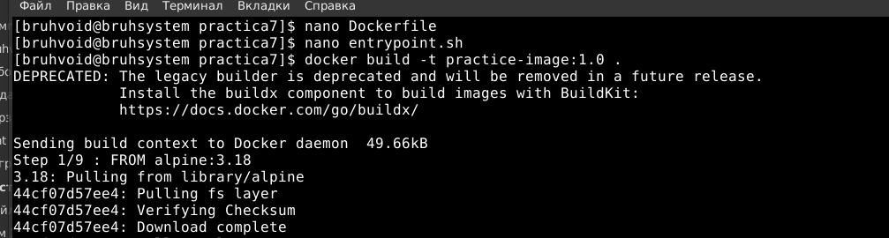
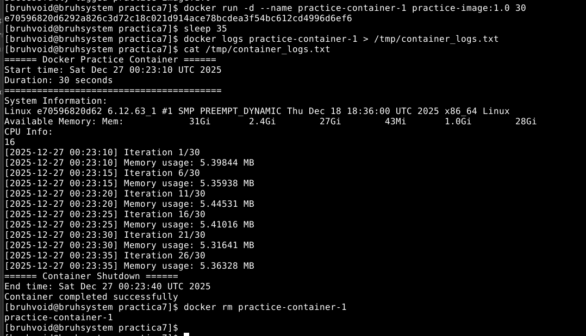
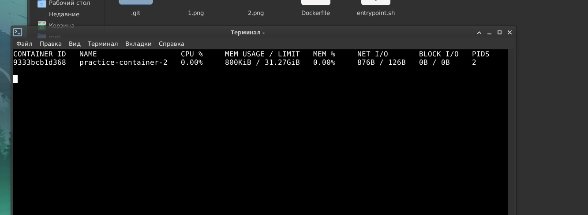
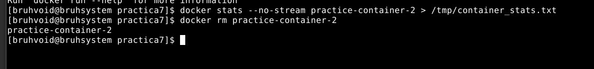
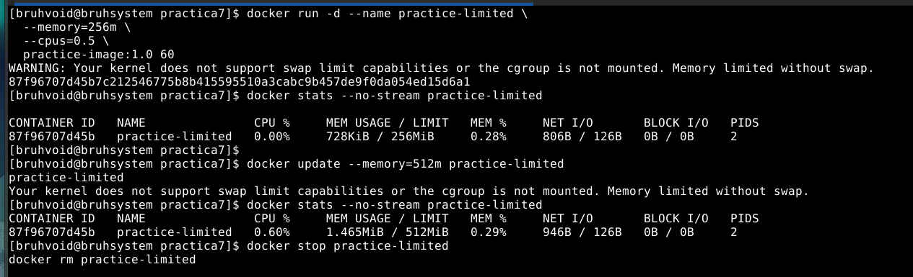
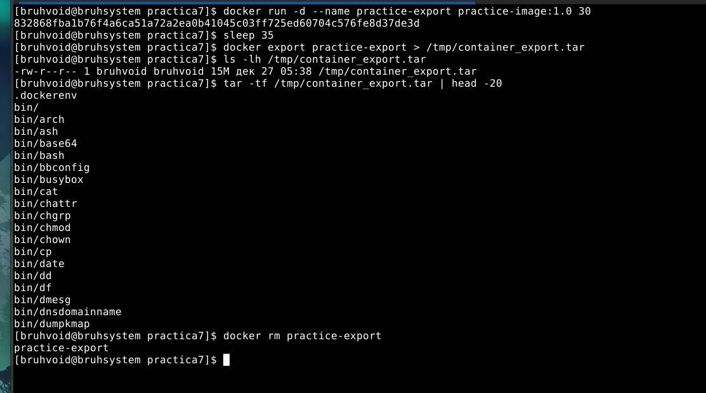
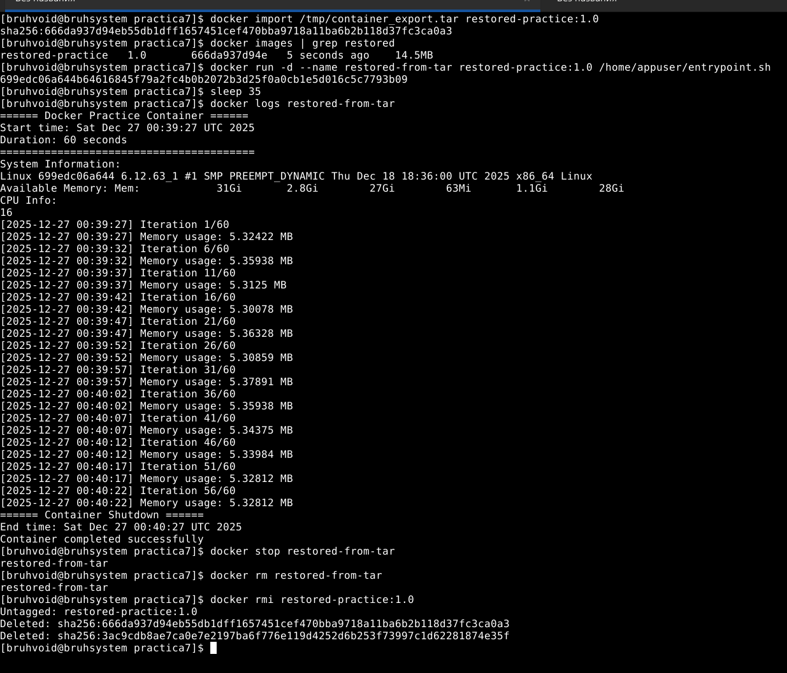

# Отчет по практической работе №7

## Цель работы

Изучение дополнительных возможностей Docker для управления жизненным циклом контейнеров, мониторинга их состояния и оптимизации использования системных ресурсов. Данная практика направлена на глубокое понимание операционных аспектов контейнеризации, что критически важно для построения надежных и масштабируемых приложений в production-среде.

## Подготовка окружения:
Создали директорию. Копировали Dockerfile и entrypoint.sh в директорию. Собрали образ

## Задание 1: Вывод логов в файл

Запустили контейнер и ожидали его завершения. Сохранили и просмотрели логи. Далее очистили контейнер.

## Задание 2: Проверка docker-stats

Запустили контейнер в background и в другом терминале просмотрели статистику в реальном времени

Очистили контейнер

## Задание 3: Ограничение ресурсов

Запусктили контейнер с ограничеснием памяти и CPU. Проверили статистику с учетом лимитов. Обновили лимиты на работающем контейнере и очистили его.

## Задание 4: Экспорт в tar

Запустили контейнер и ожидали его завершения. Экспортировали его в tar. Просмотрели содержание архива и очистили контейнер.

## Задание 5: Импорт из tar

Загрузили образ из архива, проверили его наличие. Запустили контейнер из загруженного образа, проверили логи восстановленного контейнера и очистили контейнер

